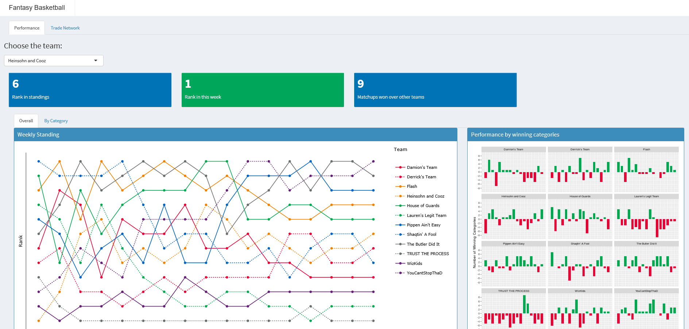
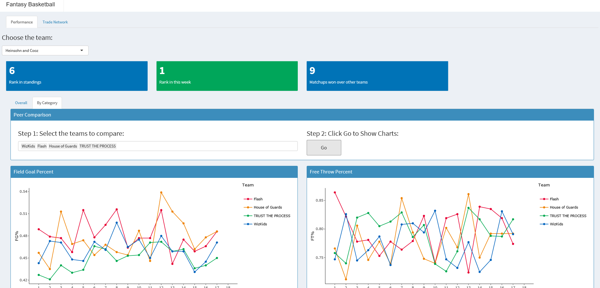

# Fantasy Basketball Dashboard

This is an RShiny-based fantasy basketball dashboard for GMs to make data driven decisoins  

### Folder structure

  +  .\\data - store data
  +  .\\graphs - some screenshots
  +  .\\src - the code folder
      - `fantasyBBll_dashboard.r`: the main rshiny code
      - `1_load_data.r`: load and preprocess data
      - `2_plot.r`: generate major plots 

 

Here are some screenshot examples:

 

